paybasz
===

Payment system for custom RFID or NFC cards (such as Dormitory access cards).
This system is similar to the ones that are used in festivals.

## About the project

- User manual: [manual.md](docs/README.md)

### Functionalities

- Support costom RFID and NFC cards/tags
- Transaction history
- Support multiple gateways at the same time
- Edit and save users
- Read account balance (from backend and from gateway)
- Staistics menu
- Function without internet access
- Wireless terminal (gateway)
- Add money to the account
- Credit line option for trusted users
- Support multiple types of relation databases

## Backend

The backend project can be found within the `backend/` directory. 

### Used technologies

- Spring-boot
- Thymeleaf
- Bootstrap 4
- All the required dependencies will be downloaded by the provided maven build tool

### How to compile

Execute `mvn clean install` command or use the attached maven wrapper. (`mvnw` on mac and linux, `mvnw.cmd` on windows)

The compiled files will be available inside the `target/` directory.

### Available functionalities

#### Analitics view

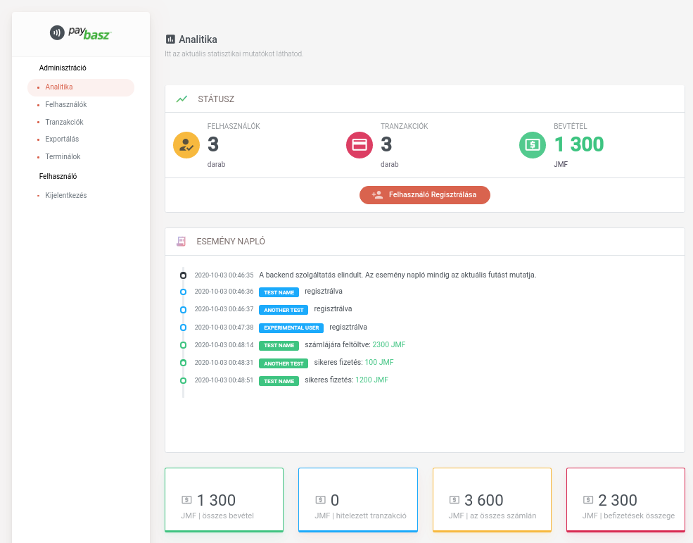

- Basic statistics
- Full system action log
- Advanced statisics

#### Users view

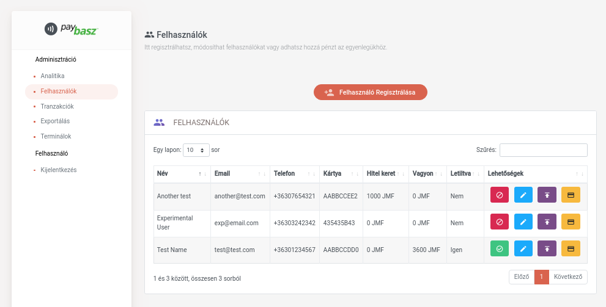

- Search for any property
- Allow/deny user
- Edit user info
- Add money
- Pay using the web terminal

#### Transaction log

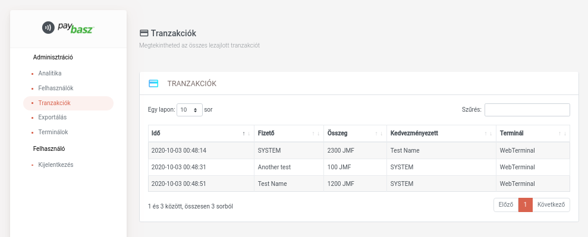

#### Add money

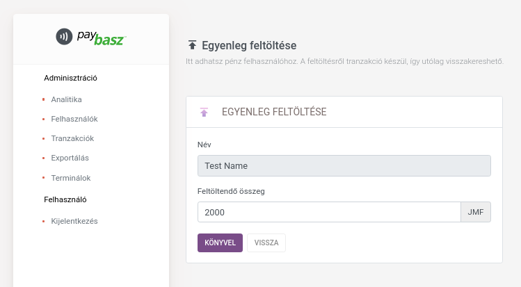

#### Add user

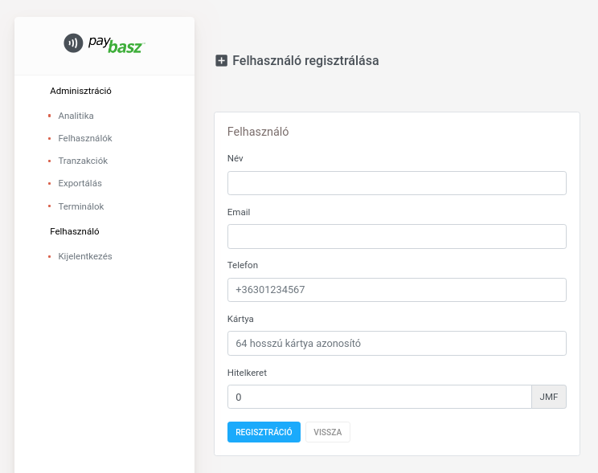

#### Pay

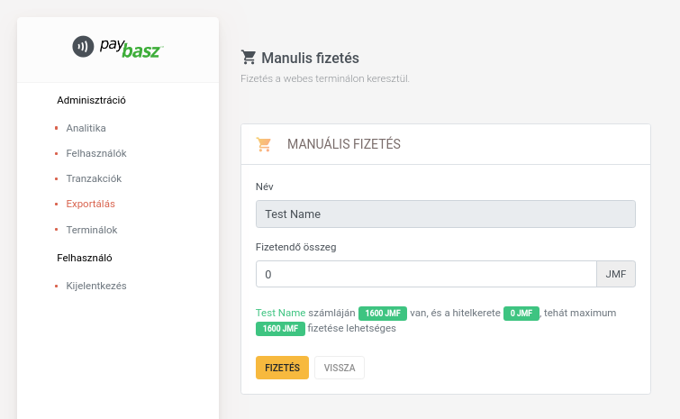

#### Gateways view

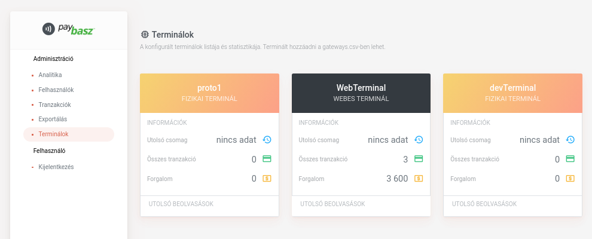

- List all of the available gateways

#### Export settings view

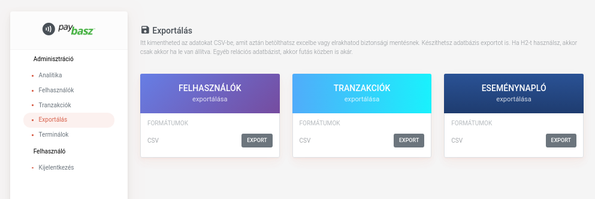

- Export users
- Export transactions
- Export system log

## Firmware

The firmware project can be found within the `firmware/` directory.

### Used technologies

- C/C++
- [Arduino CLI](https://github.com/arduino/arduino-cli)
- Arduino lib: `lcdgfx` (at least 1.0.4)
- Arduino lib: `MFRC522` (at least 1.5.1, https://github.com/MakerSpaceLeiden/rfid)
- Optional dependency: minicom (for serial debugging, you can also use Arduino IDE)

### How to compile and build

- Install Arduino CLI to the `~/arduino/bin/arduino-cli` directory.
- Install `lcdgfx` (at least 1.0.4) and `MFRC522` (at least 1.5.1). You might need to install them manually.
- Use the provided makefile (goals: cleanup, compile, build, serial, status)
- Recommended IDE: Jetbrains CLion IDE

## PCB design

### Used peripheries

|Name                          |Estimated cost|Image                               |
|------------------------------|--------------|------------------------------------|
|Esp32 DevKit v1 30pin         |$4.50         | 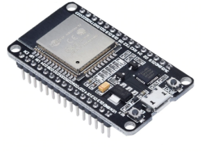   |
|RC522 SPI RFID antenna        |$0.97         | 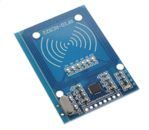   |
|0.95" OLED Display SSD1331 SPI|$5.80         | 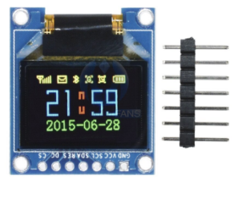     |
|Membrane switch 4x5           |$0.85         | 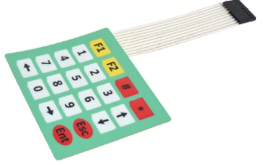 |
|Piezo buzzer                  |$0.55         | 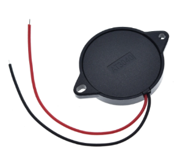 |
|10k ohm resistor x 5          |              |                                    |
|100 ohm resistor x 2          |              |                                    |
|150 ohm resistor x 1          |              |                                    |

### Prototype 1 - bread board

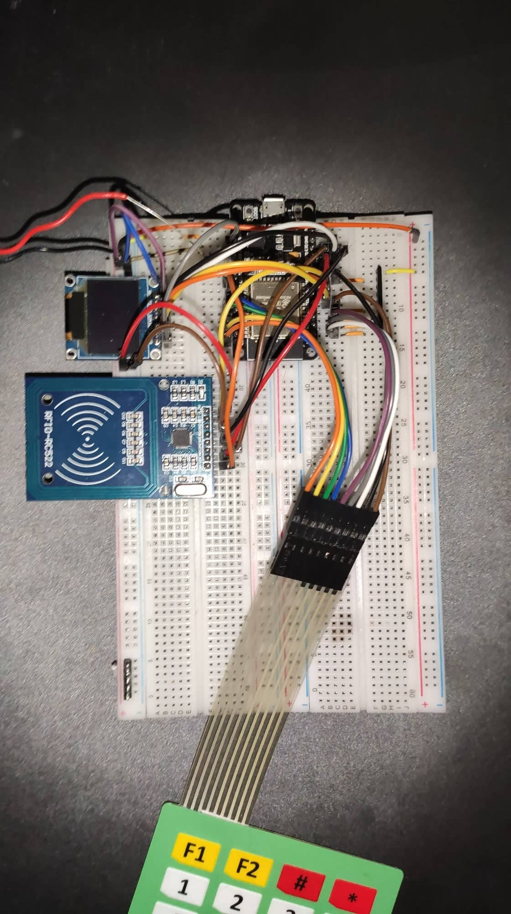

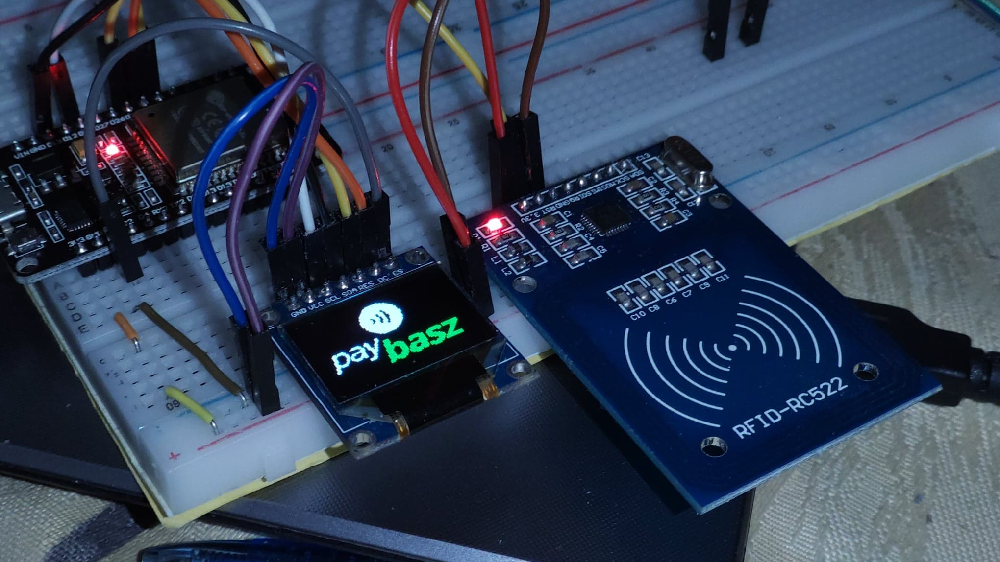

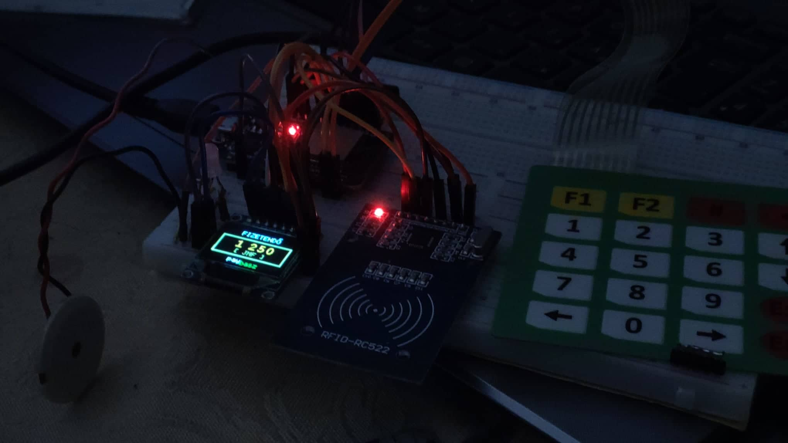

### Prototype 2 - prototype board

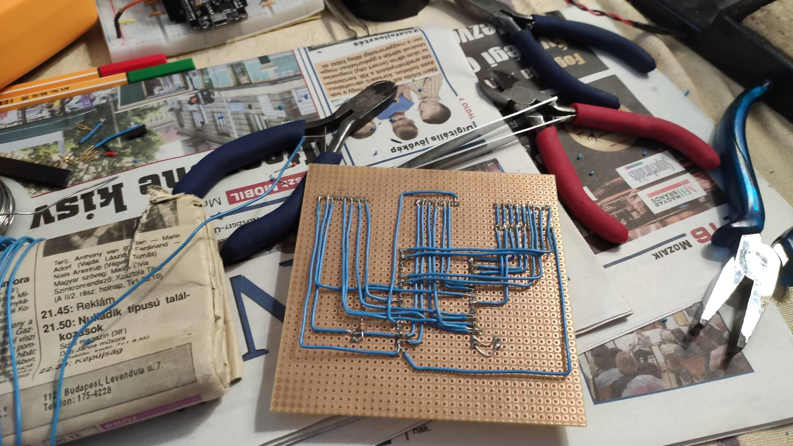

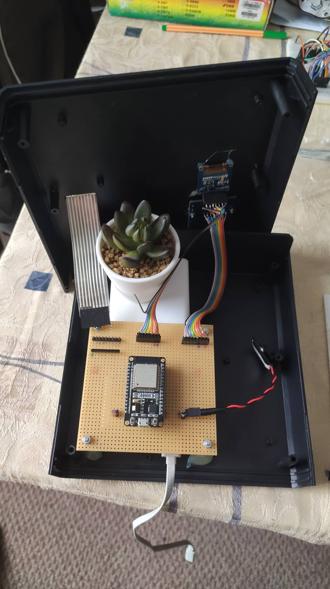

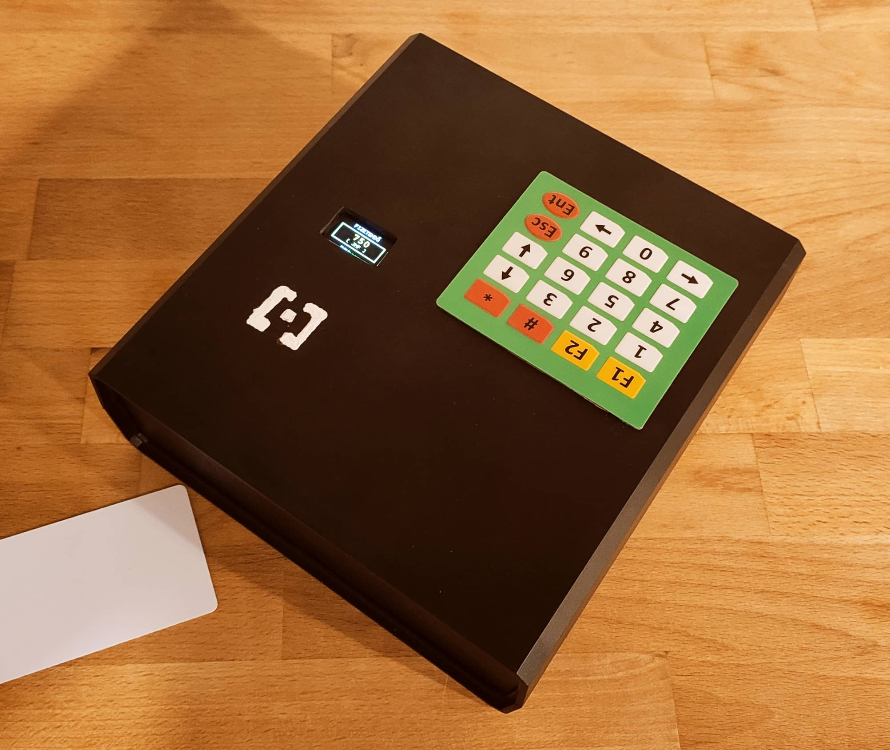

### Version 3 - PCB

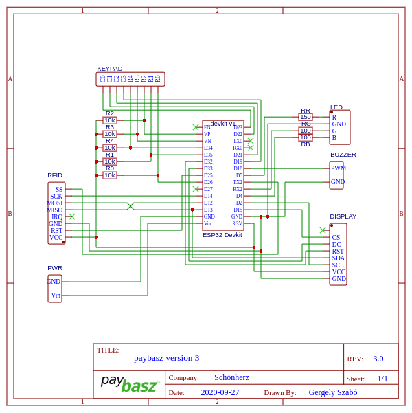

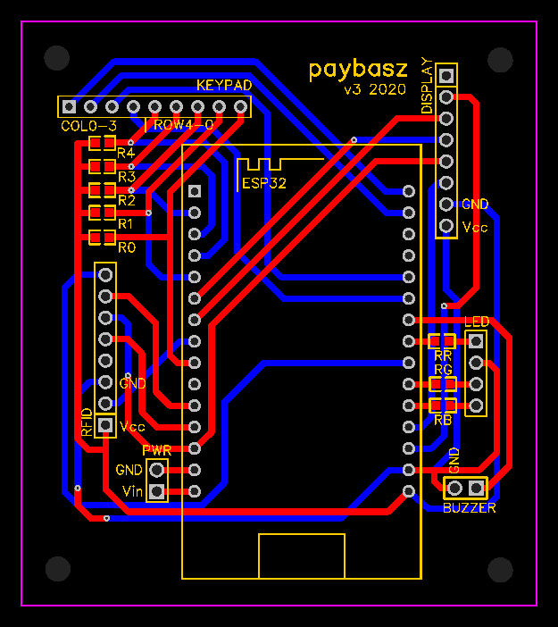

## Testing

There was a live testing this summer. It took place at the TTNY summer camp.

### Test overview

- Overall it was a success
- Most of the cards found to be compatible (revolut, transferwise, dormitory cards, bank cards, some smartphones with NFC support)
- It didn’t get very wet, it didn’t break, there was no need to replace parts

### Issues

- The box is blocked the sounds too well, so the buzzer did not sound.
- Due to a powerloss accident the DB was almost lost. Note: Do not put the server to any commonly used areas!
- A small transparent surface should be placed in front of the display.
- Don't override backups cause there might be data loss.

### Ideas for improvement

- Louder piezo buzzer
- A new property for user to indicate that the settlement was completed
- More gateway debug possibilities needed
- Named items (eg.: #117 -> "Napi menü" 650 JMF / 5dl)
- Export to unique email per user 

